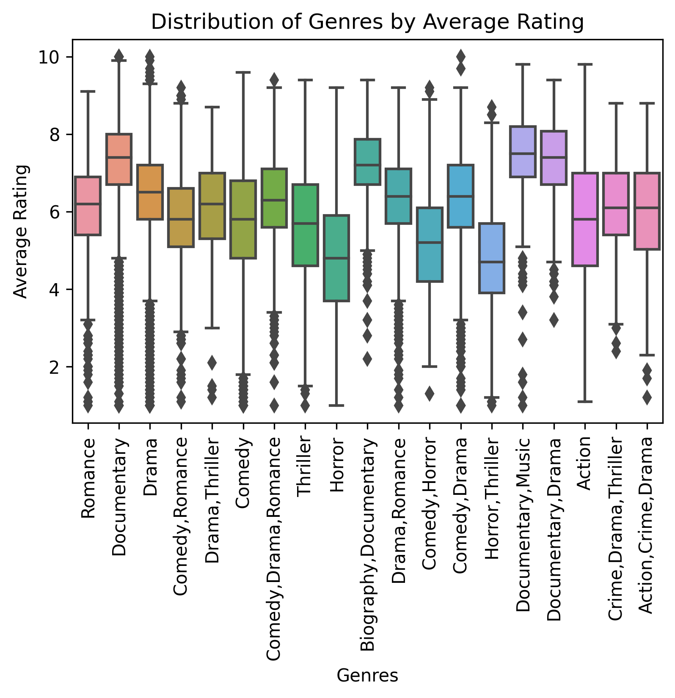

# Title Microsoft Movie Analysis

**Authors**: Ethan Helder

## Overview

Microsoft sees all the big companies creating original video content and they want to get in on the fun. They have decided to create a new movie studio, but they don’t know anything about creating movies. Using data recieved from movie review websites I descibe trends in amount grossed compared to different varibles in order to accuartely descibe how to make money in the movie industry.

## Business Problem


***
Microsoft wants to get into the movie industry but doesnt know what to do in order to make money from it. I wanted to find out exactly what qualities allowed for a movie to make money so that I can approprietly advise what to do.
***

## Data

***
I recieved this data from movie review sites such as IMDB. The data represents individual movies; how much they made, what ratings they got, what genre they are from, length of movie runtime.
I removed the outliers and missing values while totaling the amount grossed for each movie. Doing so allowed to correctly graph my findings and predict how a movie might perform.
***

## Methods

***
I broke the data down to amount grossed vs average rating to find that there is a positive correlation. Then found which genres had the highest rating as well as which genres were most frequently made.
I removed all the movies that didn't make a lot of money. I started with 100,000 and quickly raised it to only movies that made over 100,000,000. I did this to more appropriatly visualize the data.
***

## Results

I have found that the higher rating a movie gets on average the more money it makes.

Dramas and documentaries are the two most frequent genres by a large margin.

Documentaries and the 3 subcategories of documentaries recieve the four highest average ratings.

Found that even though Horrors receive the lowest average rating, they remain an outlier as the highest grossing genre on average.


## Conclusions

***
* Microsoft should enter the movie industry with a Documentary or Horror film.
* Documentaries are the second most frequent genre and the highest average rating. Due to the fact that on average the higher rating a movie recieves the more money it makes, Documentaries would be a perfect starting block to enter the movie industry.
* Horrors stand out because even though they do recieve a very low average rating they also has the highest average total grossed.
* There are many more factors that go into a money making movie such as which actors and/or directors help the movie make the most money. In order to more accuartely predict one would have to answer such questions.
***

## For More Information

Please review my full analysis in [our Jupyter Notebook](./Microsoft-Movie-Analysis.ipynb) or our [presentation](./Microsoft-Movie-Analysis-Presentation.pdf).

For any additional questions, please contact **Ethan Helder, helderethan@gmail.com**

## Repository Structure


```
├── README.md                           <- The top-level README for reviewers of this project
├── Microsoft-Movie-Analysis.ipynb   <- Narrative documentation of analysis in Jupyter notebook
├── Microsoft Movie Analysis Presentation.pdf         <- PDF version of project presentation
├── data                                <- Both sourced externally and generated from code
└── images                              <- Both sourced externally and generated from code
```
