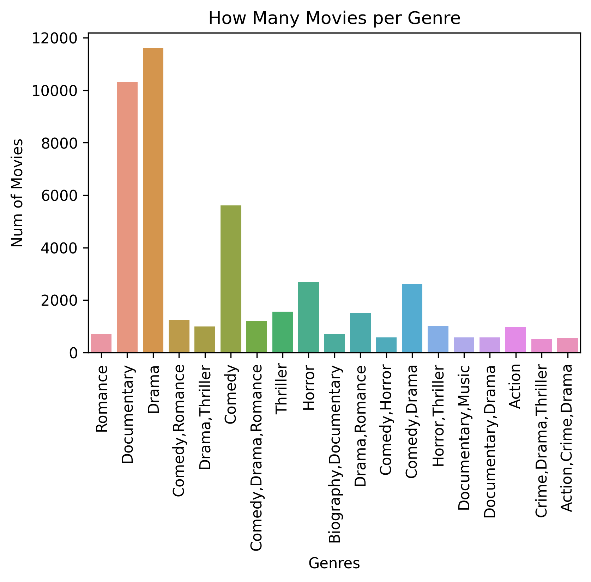

# Title Microsoft Movie Analysis

**Authors**: Ethan Helder

## Overview

Microsoft sees all the big companies creating original video content and they want to get in on the fun. They have decided to create a new movie studio, but they don’t know anything about creating movies. Using data recieved from movie review websites I descibe trends in amount grossed compared to different varibles in order to accuartely descibe how to make money in the movie industry.

## Business Problem

Summary of the business problem you are trying to solve, and the data questions that you plan to answer in order to solve them.

***
Microsoft wants to get into the movie industry but doesnt know what to do in order to make money from it. I wanted to find out exactly what qualities allowed for a movie to make money so that I can approprietly advise what to do.
***

## Data

Describe the data being used for this project.

***
I recieved this data from movie review sites such as IMDB. The data represents individual movies; how much they made, what ratings they got, what genre they are from, length of movie runtime.
I removed the outliers and missing values while totaling the amount grossed for each movie. Doing so allowed to correctly graph my findings and predict how a movie might perform.
***

## Methods

Describe the process for analyzing or modeling the data. For Phase 1, this will be descriptive analysis.

***
I broke the data down to amount grossed vs average rating to find that there is a positive correlation. Then found which genres had the highest rating as well as which genres were most frequently made.
I removed all the movies that didn't make a lot of money. I started with 100,000 and quickly raised it to only movies that made over 100,000,000. I did this to more appropriatly visualize the data.
***

## Results

Present your key results. For Phase 1, this will be findings from your descriptive analysis.

***
On average, the higher rating a movie gets the more money it makes. I have found that Documentaries recieve higher ratings as well as being the second most frequent movie genre. The best way to make money would to make a Documentary.
My visualations fit my hypothesis rather well and I am confident that it would generalize beyond the data I have. This model will help Microsoft enter into the movie industry.
***

Here is an example of how to embed images from your sub-folder:

### Visual 1




## Conclusions

Provide your conclusions about the work you've done, including any limitations or next steps.

***
Microsoft should enter the movie industry with a documentary. Documentaries are the second most frequent genre and the highest average rating. The sub-categories of documentaries are the second third and fourth highest average ratings.
There are many more factors that go into a money making movie such as which actors and/or directors help the movie make the most money. In order to more accuartely predict one would have to answer such questions.
***

## For More Information

Please review our full analysis in [our Jupyter Notebook](./dsc-phase1-project-template.ipynb) or our [presentation](./DS_Project_Presentation.pdf).

For any additional questions, please contact **Ethan Helder, helderethan@gmail.com**

## Repository Structure

Describe the structure of your repository and its contents, for example:

```
├── README.md                           <- The top-level README for reviewers of this project
├── Microsoft-Movie-Analysis.ipynb   <- Narrative documentation of analysis in Jupyter notebook
├── Microsoft Movie Analysis Presentation.pdf         <- PDF version of project presentation
├── data                                <- Both sourced externally and generated from code
└── images                              <- Both sourced externally and generated from code
```
